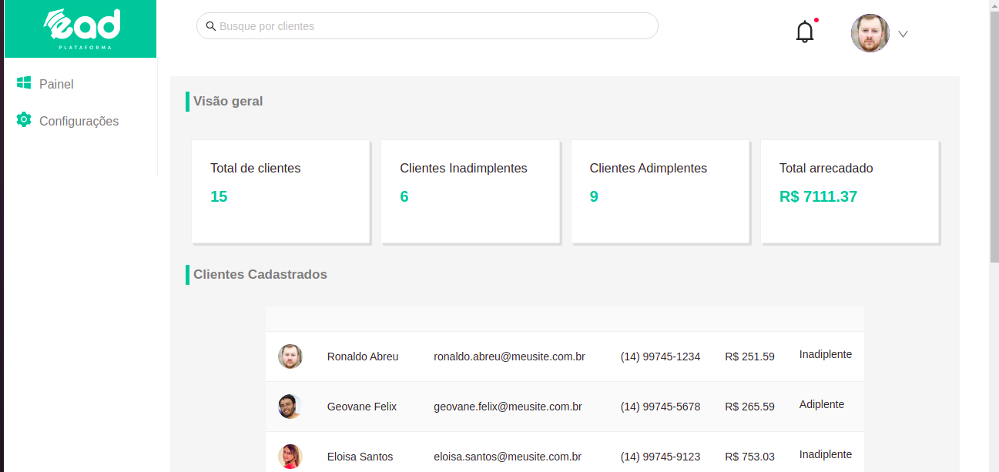

<p align="center">
   
</p>

<p align="center">	
   <a href="https://www.linkedin.com/in/andr%C3%A9-luiz-844207102/">
      
   </a>

</p>

<div align="center">

<sub>EAD Plataforma &amp; Dashboard React.js | Typescript| Jest | Ant-Design</sub>

</div>

<p align="center">
  <sub>The EAD Plataforma project. Built with ❤︎ by
    <a href="https://github.com/DehLuizSantos">André Luiz Santos</a>     
  </sub>
</p>

<br />
<div align="center">
  
</div>

<br />
<br />

--

# :eyes: Demo Website

👉 demo: https://eadplataforma.netlify.app/

# :computer: Technologies

This project was made using the follow technologies:

- [Next.js](https://nextjs.org/)
- [Typescript](https://www.typescriptlang.org/)
- [Ant-Design](https://ant.design/)

# :construction_worker: How to run

**You need to install [Node.js](https://nodejs.org/en/download/) and [Yarn](https://yarnpkg.com/) first, then:**

### Install Dependencies

```bash
yarn
```

### Run Aplication

```bash
yarn start
```

Open [http://localhost:3000](http://localhost:3000) with your browser to see the result.
<br>

Made with love by [André Luiz Santos](https://github.com/DehLuizSantos) 🚀
